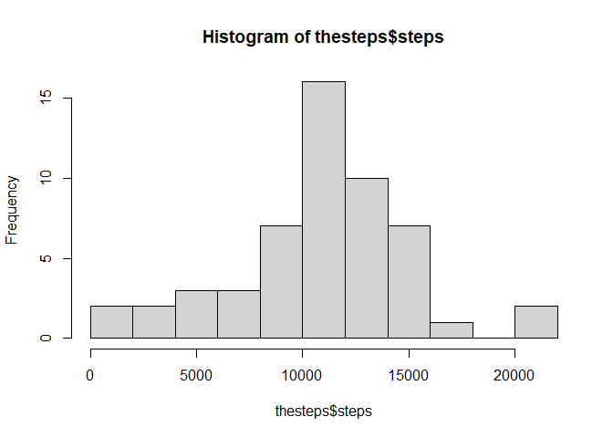
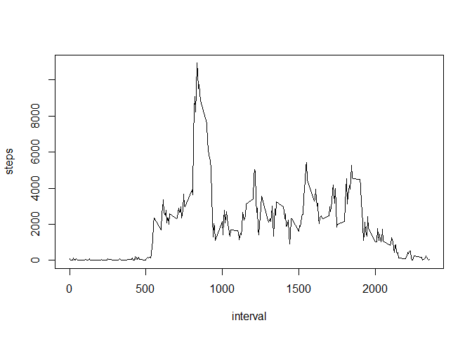
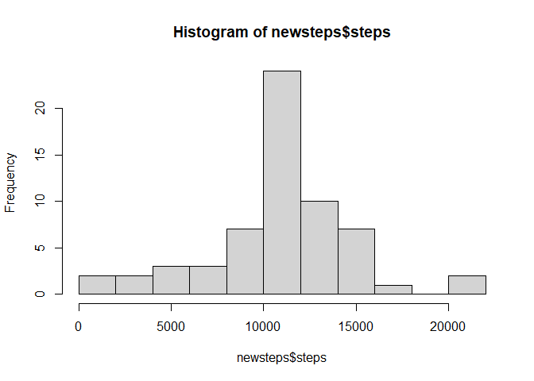
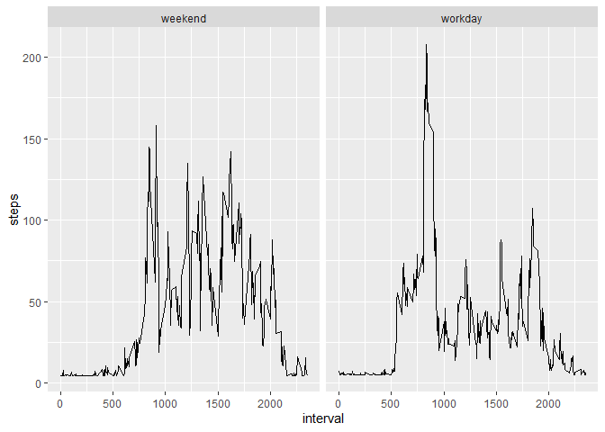

# RepData peer Assesssment 1
## Read the data
* Unzip the file and read the data.

```r
unzip("repdata_data_activity.zip", exdir = ".")
act<-read.csv("activity.csv")
```
* Simply change the form of the data and get rid of the NA value.

```r
newact<-act[!is.na(act$steps),]
thesteps <- aggregate(steps ~ date, data = newact, sum)
```

## Histogram of the total number of steps taken each day
* Make a histogram of the steps taken each day


```r
hist(thesteps$steps,breaks = 10)
```

<!-- -->

## Mean and median number of steps taken each day

* Calculate the mean and median steps per day


```r
mean(thesteps$steps)
```

```
## [1] 10766.19
```

```r
median(thesteps$steps)
```

```
## [1] 10765
```

## Time series plot of the average number of steps taken
* Create a time series diagram with 5 minute intervals and the average number of steps taken over all days (Y-axis)


```r
theinterval <- aggregate(steps ~ interval, data = newact, sum)
plot(steps ~ interval, data = theinterval , type = "l")
```

<!-- -->

## The 5-minute interval that, on average, contains the maximum number of steps
* What is the average interval of all days in the dataset for which 5 minutes contains the largest number of steps?


```r
theinterval[which.max(theinterval$steps), ]$interval
```

```
## [1] 835
```

## Strategy for imputing missing data
* Use the average number of steps per day to fill the missing data. First calculate the average number of steps taken per day, and then fill in the missing data.


```r
themean <- mean(act$steps,na.rm =TRUE)
missing_act<-act
missing_act[is.na(missing_act$steps),]$steps<-themean
```
*Simply change the form of the data


```r
newsteps <- aggregate(steps ~ date, data = missing_act, sum)
```

* Make a histogram of the steps taken each day


```r
hist(newsteps$steps,breaks = 10)
```

<!-- -->

* Calculate the mean and median steps per day


```r
mean(newsteps$steps)
```

```
## [1] 10766.19
```

```r
median(newsteps$steps)
```

```
## [1] 10766.19
```
* And what we found was that the average didn't change because what we put in is the average.But the median has changed, because the new number has been filled in, and the position of the number has changed.

## Panel plot comparing the average number of steps taken per 5-minute interval across weekdays and weekends
* First read the day of the week based on the date, then divide the data into weekend and workday based on the day of the week.

```r
Sys.setlocale("LC_TIME", "English") 
```

```
## [1] "English_United States.1252"
```

```r
missing_act$week<-ifelse(weekdays(as.Date(missing_act$date)) %in% c("Sunday","Saturday"),"weekend","workday")
missing_act2 <- aggregate(steps ~ interval + week, missing_act, mean)
```
* Draw using ggpolt2

```r
library(ggplot2)
```

```
## Warning: package 'ggplot2' was built under R version 4.0.2
```

```r
plot<-ggplot(missing_act2, aes(interval,steps,fill = week)) + geom_line()+
  facet_grid(.~week)
print(plot)
```

<!-- -->
